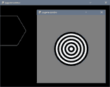
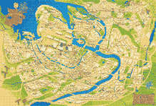
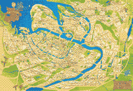
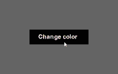
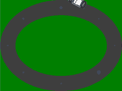
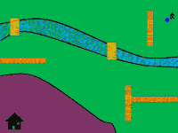

# Game Development Using Python

Solved exercises from the book “Game Development Using Python” by James R. Parker.

## Chapter 2. Graphics and Images

1. hex
1. image file
1. target
1. magnifying
1. —
1. subimage
1. bubbles
1. television

## Chapter 3. The Game Loop

1. color button
1. four lane road
1. bouncing ball 2
1. bouncing ball keys
1. noisy television
1. rotate

## Chapter 5. Navigation and Control

1. [x] elliptical track
1. [x] find path
1. [x] choose path
1. [ ] choose waypoints path
1. [ ] npc vs avatar

# Chapter 6. Sound

1. [x] play mp3
1. [x] pan
1. [x] notes
1. [x] sound recorder
