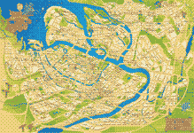
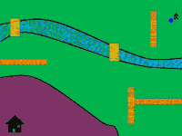

# Game Development Using Python

Solved exercises from the book “Game Development Using Python” by James R. Parker.

## Chapter 2. Graphics and Images

1. [x] hex
1. [x] image file
1. [x] target
1. [x] magnifying
1. [x] subimage
1. [ ] bubbles
1. [ ] television

## Chapter 5. Navigation and Control

1. [x] elliptical track
1. [x] find path
1. [ ] choose path
1. [ ] choose waypoints path

